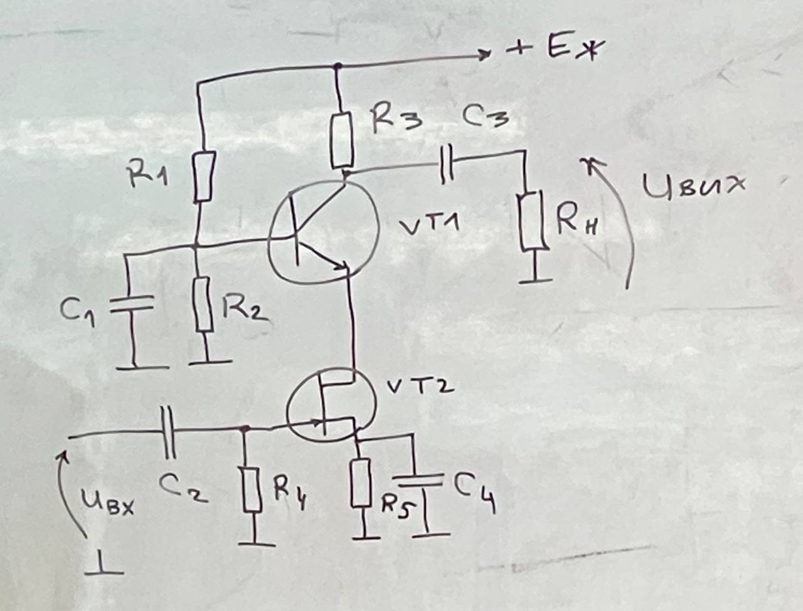
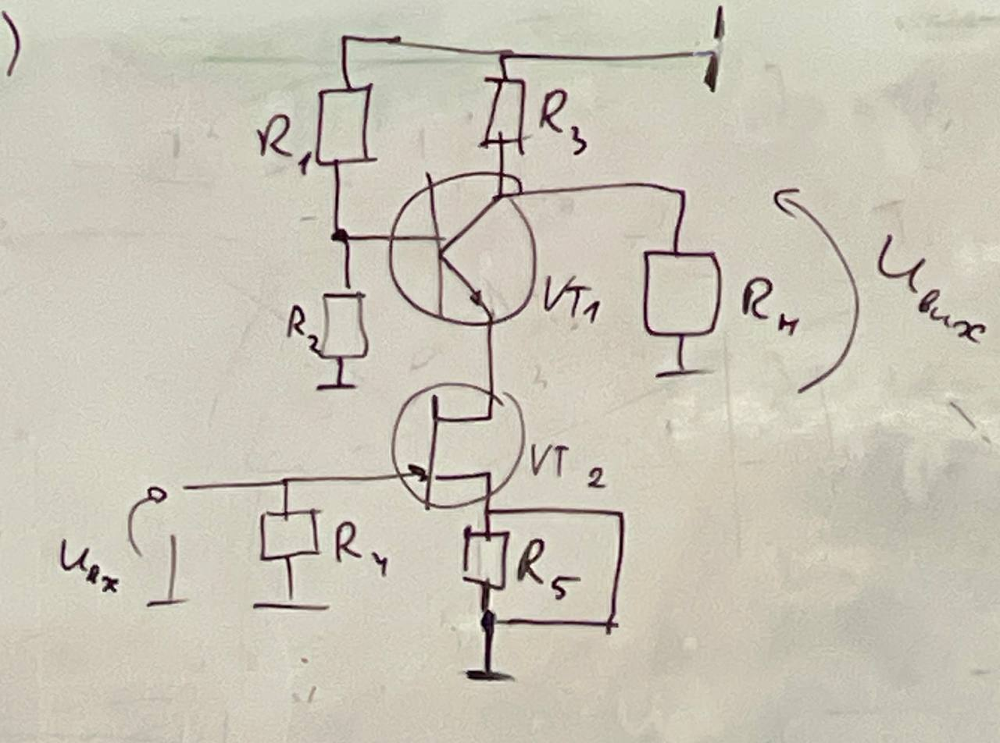
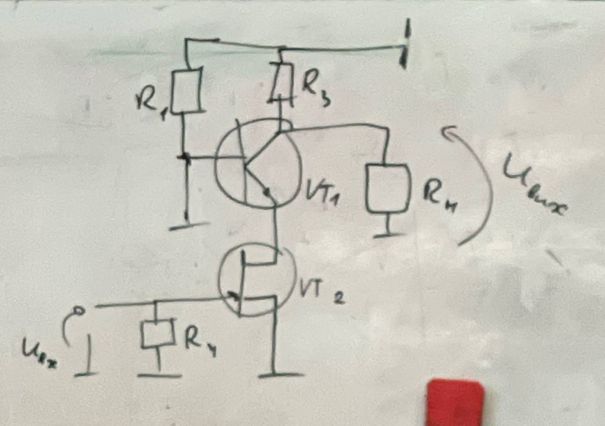
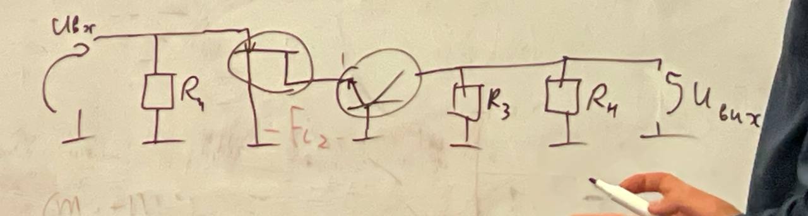
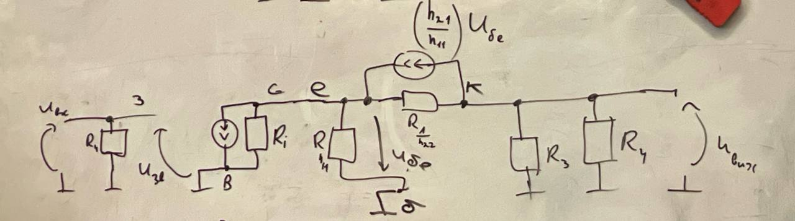

# 🛠️ Практикум: Розрахунок каскодного підсилювача матричним методом вузлових провідностей

[⬅️ Конспект Лекції 5](index.md) | [🏠 Головний зміст](../../README.md) | [⚡ Cheat Sheet](cheat-sheet.md) | [❓ Питання та відповіді](questions.md)

---

## 🎯 Мета практикуму
1. Опанувати строгий алгоритм переходу від повної принципової схеми підсилювача до **малосигнальної еквівалентної схеми** на середніх частотах.
2. Скласти **матрицю вузлових провідностей $[Y]$** з урахуванням керованих джерел струму транзисторів (макромодель $h$-параметрів для BJT та $S$-параметрів для JFET).
3. Розрахувати коефіцієнт підсилення напруги $K_U$, вхідний опір $R_{\text{вх}}$ та вихідний опір $R_{\text{вих}}$ за допомогою **алгебраїчних доповнень (мінорів) $\Delta_{ij}$**.

---

## 1. Завдання 1: Розрахунок каскодного підсилювача (СВ-СБ / JFET-BJT)

### 1.1. Початкова принципова схема та умова задачі

```text
               +E_ж (+V_CC)
                 │
      ┌──────────┴──────────┐
      │                     │
     ┌┴┐                   ┌┴┐
   R1│ │                 R3│ │
     └┬┘                   └┬┘
      │                     ├──────┤├───┐ C3
      ├───────────┬         │           │
      │           │      ┌──┴──┐       ┌┴┐
     ┌┴┐       C1 │      │ VT1 │     Rн│ │  ▲ U_вих
   R2│ │     ──┤├──┤ BJT └──┬──┘       └┬┘  │
     └┬┘          │         │           │   │
      │          ─┴─ GND    │          ─┴─ GND
     ─┴─ GND                │
                         ┌──┴──┐
               C2        │ VT2 │ JFET
  U_вх ───┤├───┬─────────┤ (СВ)│
               │         └──┬──┘
              ┌┴┐           │
            R4│ │      ┌────┴────┐
              └┬┘     ┌┴┐       ┌┴┐ C4
               │    R5│ │     C4│ │
              ─┴─ GND └┬┘       └┬┘
                       │         │
                      ─┴─ GND   ─┴─ GND
```



#### Дано:
* Каскодна конфігурація: нижній поверх — $n$-канальний JFET $VT_2$ увімкнений за схемою зі **спільним витоком (СВ)**; верхній поверх — $n-p-n$ біполярний транзистор $VT_1$ увімкнений за схемою зі **спільною базою (СБ)**.
* Параметри JFET $VT_2$: крутизна $S$, внутрішня вихідна провідність $G_i = 1/R_i$.
* Параметри BJT $VT_1$ ($h$-параметри): вхідний опір $h_{11}$, коефіцієнт підсилення струму $h_{21} = \beta$, вихідна провідність $h_{22} = 1/r_0$.
* Резистори схеми: дільник затвора $R_4$, автозміщення витоку $R_5$, дільник бази $R_1, R_2$, колекторне навантаження $R_3$, навантаження $R_н$.

#### Знайти:
1. $K_U = \frac{U_{\text{вих}}}{U_{\text{вх}}}$ — коефіцієнт передачі напруги під навантаженням;
2. $R_{\text{вх}}$ — вхідний опір каскаду;
3. $R_{\text{вих}}$ — вихідний опір каскаду.

---

### 1.2. Покроковий розв'язок

#### Крок 1. Аналіз у смузі середніх частот (СЧ) та нехтування ємностями
У смузі середніх частот ємнісний опір розділових і блокувальних конденсаторів настільки малий ($X_C = \frac{1}{\omega C} \to 0$), що ми замінюємо їх **ідеальним коротким замиканням (КЗ)**, а шину живлення $+E_ж$ заземлюємо за змінним струмом AC:
1. **$C_2, C_3$ (розділові):** закорочують змінний сигнал напряму на вхід і навантаження ($R_н$).
2. **$C_1$ (блокувальний у базі $VT_1$):** закорочує базу $VT_1$ на землю ($U_б = 0$). Резистори дільника $R_1$ і $R_2$ виявляються запаралеленими на землю і не впливають на змінний сигнал.
3. **$C_4$ (блокувальний у витоку $VT_2$):** закорочує витік $VT_2$ на землю ($U_в = 0$), усуваючи резистор $R_5$ зі схеми змінного струму.




---

#### Крок 2. Перемальовування схеми за змінним струмом AC

Витягуємо всі елементи від входу до виходу:
* Вхідний вузол: паралельно затвору стоїть резистор $R_4$.
* Транзистор $VT_2$ (СВ): затвор — вхід, витік заземлений, стік з'єднаний з емітером $VT_1$.
* Транзистор $VT_1$ (СБ): база заземлена, емітер — вхід 2-го каскаду, колектор — вихід.
* Вихідний вузол: паралельно колектору стоять $R_3$ та навантаження $R_н$.



---

#### Крок 3. Заміна транзисторів макромоделями та нумерація вузлів

Замінимо активні прилади їхніми лінійними малосигнальними еквівалентними схемами:
* **JFET $VT_2$:** вхідний струм затвора дорівнює нулю; вихідне коло стік-витік моделюється керованим джерелом струму $i_{d} = S \cdot U_{\text{зв}}$ паралельно з внутрішньою провідністю $G_i = 1/R_i$.
* **BJT $VT_1$ (схема зі спільною базою):**
  * Вхідне коло емітер-база: вхідна провідність $\frac{1}{h_{11}}$ та струм емітера. Оскільки $i_б = \frac{U_{\text{бе}}}{h_{11}} = - \frac{U_{\text{еб}}}{h_{11}}$, напруга бази-емітера керує струмом колектора.
  * Кероване джерело струму колектора: $i_{c} = h_{21} \cdot i_б = \left(\frac{h_{21}}{h_{11}}\right) U_{\text{бе}}$.
  * Внутрішня вихідна провідність колекторного переходу: $h_{22} = \frac{1}{r_0}$.



#### Виділимо 3 незалежні вузли відносно заземленої шини (GND):
* **Вузол 1 (Вхідний):** затвор $VT_2$ ($U_1 = U_{\text{вх}} = U_{\text{зв}}$);
* **Вузол 2 (Вихідний):** колектор $VT_1$ ($U_2 = U_{\text{вих}}$);
* **Вузол 3 (Проміжний):** точка з'єднання стоку $VT_2$ та емітера $VT_1$ ($U_3 = U_{\text{с2}} = U_{\text{е1}}$). Зверніть увагу: $U_{\text{бе}} = U_б - U_е = 0 - U_3 = - U_3$.

---

## 2. Складання матриці вузлових провідностей $[Y]$

Запишемо систему рівнянь за першим законом Кірхгофа у вузловій матричній формі:

$$\begin{bmatrix} Y_{11} & Y_{12} & Y_{13} \\ Y_{21} & Y_{22} & Y_{23} \\ Y_{31} & Y_{32} & Y_{33} \end{bmatrix} \begin{bmatrix} U_1 \\ U_2 \\ U_3 \end{bmatrix} = \begin{bmatrix} I_{\text{вх}} \\ 0 \\ 0 \end{bmatrix}$$

### Аналіз внесків пасивних провідностей та активних керованих джерел:

1. **Пасивна частина (власні та взаємні провідності контурів):**
   * Вузол 1: підключена лише провідність $G_4 = 1/R_4 \implies Y_{11} = G_4$.
   * Вузол 2: підключені провідності навантаження $G_н = 1/R_н$, колектора $G_3 = 1/R_3$, та провідність транзистора $h_{22}$ між вузлами 2 і 3 $\implies Y_{22} = h_{22} + G_3 + G_н$.
   * Вузол 3: підключені провідність емітера $\frac{1}{h_{11}}$, вихідна провідність JFET $G_i$, та $h_{22}$ $\implies Y_{33} = G_i + \frac{1}{h_{11}} + h_{22}$.
   * Взаємний зв'язок між вузлами 2 та 3 через $h_{22} \implies Y_{23}^{\text{пас}} = -h_{22}$, $Y_{32}^{\text{пас}} = -h_{22}$.

2. **Врахування керованих джерел (активні несиметричні внески):**
   * Джерело струму JFET $S \cdot U_1$: витікає з вузла 3 на землю. Оскільки струм спрямований від вузла 3, у 3-му рядку у стовпчику напруги керування $U_1$ з'являється $+S \implies Y_{31} = +S$.
   * Джерело струму BJT $\left(\frac{h_{21}}{h_{11}}\right) U_{\text{бе}} = - \left(\frac{h_{21}}{h_{11}}\right) U_3$:
     * Втікає у вузол 2 від вузла 3: додає $-\frac{h_{21}}{h_{11}}$ до елемента $Y_{23}$.
     * Витікає з вузла 3: додає $+\frac{h_{21}}{h_{11}}$ до власної провідності вузла 3 ($Y_{33}$).

### Результуюча матриця провідностей $[Y]$:

$$\mathbf{[Y]} = \begin{bmatrix}
\mathbf{G_4} & 0 & 0 \\
0 & \mathbf{h_{22} + G_3 + G_н} & \mathbf{-h_{22} - \frac{h_{21}}{h_{11}}} \\
\mathbf{S} & \mathbf{-h_{22}} & \mathbf{G_i + \frac{1}{h_{11}} + h_{22} + \frac{h_{21}}{h_{11}}}
\end{bmatrix}$$

> 💡 **Зверніть увагу:** До врахування активних керованих джерел матриця провідностей є строго симетричною ($Y_{ij} = Y_{ji}$). Поява джерел струму $S$ та $\frac{h_{21}}{h_{11}}$ робить матрицю **несиметричною**.

---

## 3. Розрахунок характеристик через визначники та алгебраїчні доповнення

За загальною теорією чотириполюсників, схемні функції визначаються через визначник матриці $\Delta = \det [Y]$ та його алгебраїчні доповнення $\Delta_{ij}$:

$$\Delta_{ij} = (-1)^{i+j} \cdot M_{ij}$$

де $M_{ij}$ — мінор, утворений викреслюванням $i$-го рядка та $j$-го стовпчика.

---

### 3.1. Розрахунок коефіцієнта підсилення напруги $K_U$

Коефіцієнт передачі напруги від входу (вузол 1) до виходу (вузол 2):

$$K_U = \frac{U_{\text{вих}}}{U_{\text{вх}}} = \frac{U_2}{U_1} = \frac{\Delta_{12}}{\Delta_{11}}$$

#### Крок 1. Обчислюємо алгебраїчне доповнення $\Delta_{12}$:
Викреслюємо 1-й рядок і 2-й стовпчик матриці $[Y]$:

$$\Delta_{12} = (-1)^{1+2} \cdot \det \begin{bmatrix} 0 & -h_{22} - \frac{h_{21}}{h_{11}} \\ S & G_i + \frac{1}{h_{11}} + h_{22} + \frac{h_{21}}{h_{11}} \end{bmatrix}$$

$$\Delta_{12} = -1 \cdot \left[ 0 \cdot \left(G_i + \frac{1}{h_{11}} + h_{22} + \frac{h_{21}}{h_{11}}\right) - S \cdot \left(-h_{22} - \frac{h_{21}}{h_{11}}\right) \right]$$

$$\Delta_{12} = - S \left(h_{22} + \frac{h_{21}}{h_{11}}\right)$$

Оскільки зазвичай $\frac{h_{21}}{h_{11}} \gg h_{22}$ (бо $\frac{h_{21}}{h_{11}} = g_m \approx 40\text{ мСм}$, а $h_{22} \approx 0.01\text{ мСм}$):
$$\Delta_{12} \approx - S \frac{h_{21}}{h_{11}}$$

---

#### Крок 2. Обчислюємо алгебраїчне доповнення $\Delta_{11}$:
Викреслюємо 1-й рядок і 1-й стовпчик:

$$\Delta_{11} = (-1)^{1+1} \cdot \det \begin{bmatrix} h_{22} + G_3 + G_н & -h_{22} - \frac{h_{21}}{h_{11}} \\ -h_{22} & G_i + \frac{1 + h_{21}}{h_{11}} + h_{22} \end{bmatrix}$$

$$\Delta_{11} = (h_{22} + G_3 + G_н) \left( G_i + h_{22} + \frac{h_{21} + 1}{h_{11}} \right) - (-h_{22}) \left( -h_{22} - \frac{h_{21}}{h_{11}} \right)$$

Розкриваємо добуток:
$$\Delta_{11} = h_{22} \left( G_i + h_{22} + \frac{h_{21} + 1}{h_{11}} \right) + (G_3 + G_н) \left( G_i + h_{22} + \frac{h_{21} + 1}{h_{11}} \right) - h_{22}^2 - h_{22} \frac{h_{21}}{h_{11}}$$

Скорочуємо $h_{22}^2$ та $h_{22} \frac{h_{21}}{h_{11}}$:
$$\mathbf{\Delta_{11} = h_{22} \left( G_i + \frac{1}{h_{11}} \right) + (G_3 + G_н) \left( G_i + h_{22} + \frac{h_{21} + 1}{h_{11}} \right)}$$

---

#### Крок 3. Підстановка та покрокове скорочення формули $K_U$:

$$K_U = \frac{\Delta_{12}}{\Delta_{11}} = \frac{- S \left(h_{22} + \frac{h_{21}}{h_{11}}\right)}{h_{22}\left(G_i + \frac{1}{h_{11}}\right) + (G_3 + G_н)\left(G_i + h_{22} + \frac{h_{21}+1}{h_{11}}\right)}$$

Застосуємо практичні інженерні наближення:
1. $h_{22} \ll \frac{h_{21}}{h_{11}}$ у чисельнику:
   $$K_U \approx \frac{- S \frac{h_{21}}{h_{11}}}{h_{22}\left(G_i + \frac{1}{h_{11}}\right) + (G_3 + G_н)\left(G_i + \frac{h_{21}+1}{h_{11}}\right)}$$

2. У знаменнику $\frac{h_{21}+1}{h_{11}} \approx \frac{h_{21}}{h_{11}} \gg G_i \gg h_{22}$:
   $$K_U \approx \frac{- S \frac{h_{21}}{h_{11}}}{(G_3 + G_н) \frac{h_{21}}{h_{11}}}$$

3. Скорочуємо спільний множник $\frac{h_{21}}{h_{11}}$:
   $$K_U \approx - \frac{S}{G_3 + G_н} = - S \cdot \left( R_3 \parallel R_н \right)$$

> 💡 **Фізичний зміст результату:**
> Коефіцієнт підсилення каскодної схеми СВ-СБ дорівнює добутку крутизни вхідного польового транзистора $S$ на повний опір навантаження колектора $(R_3 \parallel R_н)$, а знак «$-$» вказує на інверсію фази! Верхній транзистор зі спільною базою працює як ідеальний струмовий буфер і передає струм стоку JFET у навантаження без втрат.

---

### 3.2. Розрахунок вхідного опору $R_{\text{вх}}$

Вхідний опір визначається відношенням визначників:

$$R_{\text{вх}} = \frac{\Delta_{11}}{\Delta}$$

Оскільки в 1-му стовпчику матриці $[Y]$ єдиний ненульовий елемент у першому рядку — це $G_4$ (або при розкладанні за 1-м рядком $\Delta = G_4 \cdot \Delta_{11}$):

$$\Delta = G_4 \cdot \Delta_{11}$$

Підставляємо у вираз для вхідного опору:

$$R_{\text{вх}} = \frac{\Delta_{11}}{G_4 \cdot \Delta_{11}} = \frac{1}{G_4} = \mathbf{R_4}$$

> **Висновок:** Завдяки ізольованому затвору польового транзистора $VT_2$ ($I_g \approx 0$), вхідний опір каскаду повністю визначається номіналом резистора витоку $R_4$ і може досягати десятків мегаом.

---

### 3.3. Розрахунок вихідного опору $R_{\text{вих}}$

Вихідний опір розраховується при закороченому вході ($U_{\text{вх}} = 0$) без урахування навантаження ($G_н = 0$):

$$R_{\text{вих}} = \frac{\Delta_{22, 11}}{\Delta_{11(G_н = 0)}}$$

де $\Delta_{22, 11}$ — мінор, отриманий одночасним викреслюванням 1-го і 2-го рядків та 1-го і 2-го стовпчиків (тобто елемент $Y_{33}$):

$$\Delta_{22, 11} = Y_{33} = G_i + \frac{1}{h_{11}} + h_{22} + \frac{h_{21}}{h_{11}} \approx \frac{h_{21}}{h_{11}}$$

Підставляючи $\Delta_{11}$ при $G_н = 0$:

$$R_{\text{вих}} \approx \frac{\frac{h_{21}}{h_{11}}}{G_3 \cdot \frac{h_{21}}{h_{11}}} = \frac{1}{G_3} = \mathbf{R_3}$$

---

## 4. Загальна теорія матричного методу вузлових провідностей $[Y][U] = [I]$

Матричний метод вузлових потенціалів (Nodal Admittance Matrix Analysis) є фундаментальним алгоритмом комп'ютерного моделювання електронних схем (покладений в основу рушіїв **SPICE, LTspice, Multisim**).

```text
               Вузловий закон струмів:
                   [Y] · [U] = [I]
                        │
       ┌────────────────┴────────────────┐
       ▼                                 ▼
  Матриця провідностей [Y]      Вектор напруг [U]
  - Діагональ Y_ii: сума        та вектор задаючих
    провідностей у вузлі i       струмів джерел [I]
  - Поза діагоналлю Y_ij:
    провідності зв'язку
```

### 4.1. Алгоритм формування матриці $[Y]$ для $N$ вузлів:

1. **Вибір опорного вузла:** Один із вузлів схеми обирається за **базовий (GND, $U_0 = 0$)**.
2. **Головна діагональ ($Y_{ii}$):** Власна провідність $i$-го вузла — дорівнює сумі всіх провідностей, підключених до цього вузла:
   $$Y_{ii} = \sum G_{\text{підкл. до } i}$$
3. **Позадіагональні елементи ($Y_{ij}, i \neq j$):** Взаємна провідність між вузлами $i$ та $j$ — береться зі знаком **«мінус»**:
   $$Y_{ij} = - \sum G_{\text{між } i \text{ та } j}$$
4. **Врахування керованих джерел струму (VCCS — Voltage-Controlled Current Source):**
   Якщо в схемі є джерело струму величиною $g_m \cdot (U_a - U_b)$, увімкнене між вузлами $c$ (витікає) та $d$ (втікає):
   * У рядок $d$ додаються: $+g_m$ у стовпчик $a$, $-g_m$ у стовпчик $b$;
   * У рядок $c$ додаються: $-g_m$ у стовпчик $a$, $+g_m$ у стовпчик $b$.

---

### 4.2. Зведена таблиця обчислення параметрів чотириполюсника за матрицею $[Y]$

| Параметр чотириполюсника | Формула через алгебраїчні доповнення | Фізичний зміст |
| :--- | :---: | :--- |
| **Коефіцієнт підсилення напруги $K_U$** | $\mathbf{K_U = \frac{\Delta_{12}}{\Delta_{11}}}$ | Відношення вихідної напруги до вхідної |
| **Коефіцієнт підсилення струму $K_I$** | $\mathbf{K_I = \frac{\Delta_{12}}{\Delta_{22}} \cdot \frac{G_н}{G_{\text{вх}}}}$ | Відношення струму навантаження до вхідного струму |
| **Вхідна провідність $Y_{\text{вх}}$** | $\mathbf{Y_{\text{вх}} = \frac{\Delta}{\Delta_{11}}}$ | Провідність, яку бачить джерело сигналу ($R_{\text{вх}} = 1/Y_{\text{вх}}$) |
| **Вихідна провідність $Y_{\text{вих}}$** | $\mathbf{Y_{\text{вих}} = \frac{\Delta}{\Delta_{22}}}$ | Провідність, яку бачить навантаження ($R_{\text{вих}} = 1/Y_{\text{вих}}$) |
| **Передавальний імпеданс $Z_{21}$** | $\mathbf{Z_{21} = \frac{\Delta_{12}}{\Delta}}$ | Відношення вихідної напруги до вхідного струму |

---

[⬅️ Конспект Лекції 5](index.md) | [🏠 Головний зміст](../../README.md) | [⚡ Cheat Sheet](cheat-sheet.md) | [❓ Питання та відповіді](questions.md)