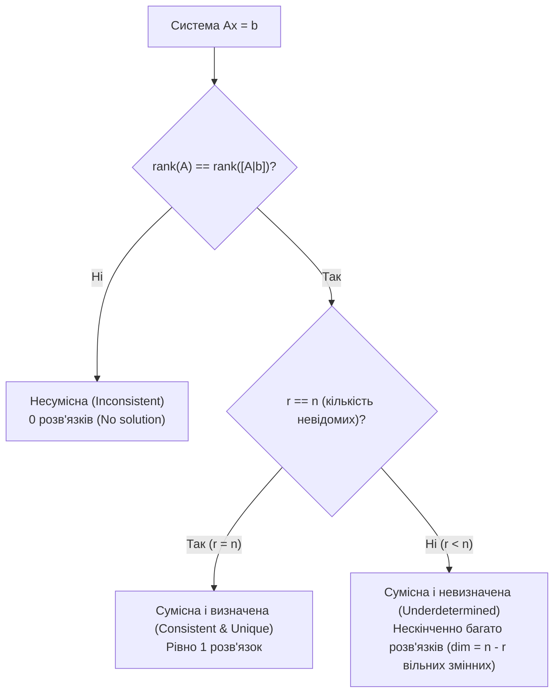

# 01. Системи лінійних рівнянь та метод Гаусса (Systems of Linear Equations & Gaussian Elimination)

[🏠 Головний зміст](index.md) | [Наступна тема: 02. Матриці, вектори та LU-розклад ➡️](02-matrices-vectors-and-lu-factorization.md) | [⚡ Cheat Sheet](cheat-sheet.md)

---

## 🎯 Ключові концепції (Core Concepts)
1. **Система лінійних алгебраїчних рівнянь (System of Linear Equations / SLE):** Сукупність $m$ рівнянь з $n$ невідомими.
2. **Матрична форма (Matrix Form):** Запис у вигляді $A \mathbf{x} = \mathbf{b}$.
3. **Елементарні рядкові перетворення (Elementary Row Operations / ERO):** Перетворення, що зберігають множину розв'язків.
4. **Ступінчастий вигляд (Row Echelon Form / REF) та спрощений ступінчастий вигляд (Reduced Row Echelon Form / RREF).**
5. **Теорема Кронекера-Капеллі (Rouché–Capelli Theorem):** Критерій існування та єдиності розв'язків.

---

## 1. Системи лінійних рівнянь (Systems of Linear Equations)

### 1.1. Загальний та матричний вигляд
Система з $m$ рівнянь та $n$ невідомих:
$$
\begin{cases}
a_{11} x_1 + a_{12} x_2 + \dots + a_{1n} x_n = b_1 \\
a_{21} x_1 + a_{22} x_2 + \dots + a_{2n} x_n = b_2 \\
\vdots \\
a_{m1} x_1 + a_{m2} x_2 + \dots + a_{mn} x_n = b_m
\end{cases}
\iff
A \mathbf{x} = \mathbf{b}
$$

де:
* $A \in \mathbb{R}^{m \times n}$ — **матриця коефіцієнтів (coefficient matrix)**.
* $\mathbf{x} = [x_1, x_2, \dots, x_n]^T \in \mathbb{R}^n$ — **вектор невідомих (vector of unknowns)**.
* $\mathbf{b} = [b_1, b_2, \dots, b_m]^T \in \mathbb{R}^m$ — **вектор вільних членів (right-hand side vector / constant vector)**.
* $[A \mid \mathbf{b}] \in \mathbb{R}^{m \times (n+1)}$ — **розширена матриця (augmented matrix)**.

> **💡 Геометрична інтуїція (Geometric Intuition):**
> * **Рядковий погляд (Row Picture):** Кожне рівняння визначає гіперплощину (hyperplane) в $\mathbb{R}^n$. Розв'язок — точка перетину всіх гіперплощин.
> * **Стовпчиковий погляд (Column Picture):** Лінійна комбінація векторів-стовпців матриці $A$: $x_1 \mathbf{a}_1 + x_2 \mathbf{a}_2 + \dots + x_n \mathbf{a}_n = \mathbf{b}$. Розв'язок — коефіцієнти розкладу вектора $\mathbf{b}$ за стовпцями $A$.

---

## 2. Метод виключення Гаусса та Гаусса-Жордана (Gaussian & Gauss-Jordan Elimination)

### 2.1. Елементарні перетворення рядків (Elementary Row Operations)
1. **Перестановка рядків (Row Swap):** $R_i \leftrightarrow R_j$.
2. **Множення рядка на ненульовий скаляр (Row Scaling):** $R_i \leftarrow c R_i \quad (c \neq 0)$.
3. **Додавання кратного одного рядка до іншого (Row Addition / Elimination):** $R_i \leftarrow R_i + c R_j$.

### 2.2. Форми матриць після виключення
* **Ступінчастий вигляд (Row Echelon Form / REF):**
  1. Усі нульові рядки знаходяться в самому низу.
  2. Перший ненульовий елемент кожного ненульового рядка (провідний елемент / ведучий елемент / **pivot**) знаходиться строго праворуч від ведучого елемента попереднього рядка.
  3. Усі елементи під ведучим елементом дорівнюють нулю.
* **Спрощений (зведений) ступінчастий вигляд (Reduced Row Echelon Form / RREF):**
  1. Матриця знаходиться в REF.
  2. Кожен провідний елемент (pivot) дорівнює **1**.
  3. Ведучий елемент є **єдиним ненульовим елементом у своєму стовпці** (всі елементи і над ним, і під ним дорівнюють 0).

```text
       Ступінчастий вигляд (REF)            Зведений вигляд (RREF)
       [ p  *  *  * ]                       [ 1  0  *  0 ]
       [ 0  p  *  * ]                       [ 0  1  *  0 ]
       [ 0  0  0  p ]                       [ 0  0  0  1 ]
       [ 0  0  0  0 ]                       [ 0  0  0  0 ]
   (де p != 0 - ведучі елементи / pivots, * - будь-які числа)
```

* **Метод Гаусса (Gaussian Elimination):** Прямий хід ($[A \mid \mathbf{b}] \to \text{REF}$) + зворотна підстановка (**back-substitution**).
* **Метод Гаусса-Жордана (Gauss-Jordan Elimination):** Прямий і зворотний хід ($[A \mid \mathbf{b}] \to \text{RREF}$), розв'язки зчитуються безпосередньо.

---

## 3. Існування та єдиність розв'язків (Existence and Uniqueness of Solutions)

### 3.1. Теорема Кронекера-Капеллі (Rouché–Capelli Theorem)
Система лінійних рівнянь $A\mathbf{x} = \mathbf{b}$ сумісна тоді і тільки тоді, коли ранг матриці коефіцієнтів дорівнює рангу розширеної матриці:
$$
\text{rank}(A) = \text{rank}([A \mid \mathbf{b}]) = r
$$

### 3.2. Класифікація розв'язків



1. **Сумісна система (Consistent System):** Має хоча б один розв'язок.
   * **Єдиний розв'язок (Unique Solution):** $\text{rank}(A) = \text{rank}([A \mid \mathbf{b}]) = n$. Усі змінні є головними (**pivot variables / basic variables**), вільних змінних немає.
   * **Нескінченна кількість розв'язків (Infinitely Many Solutions):** $\text{rank}(A) = \text{rank}([A \mid \mathbf{b}]) = r < n$. Існує $k = n - r$ **вільних змінних (free variables)**.
2. **Несумісна система (Inconsistent System):** $\text{rank}(A) < \text{rank}([A \mid \mathbf{b}])$.
   * У ступінчастому вигляді з'являється суперечливий рядок вигляду:
     $$[0\ 0\ \dots\ 0 \mid c], \quad c \neq 0 \iff 0 \cdot x_1 + \dots + 0 \cdot x_n = c \quad (\text{хиба})$$

---

## 4. Однорідні системи рівнянь (Homogeneous Systems)
Система вигляду $A\mathbf{x} = \mathbf{0}$:
* **Завжди сумісна (Always consistent):** завжди має як мінімум **тривіальний розв'язок (trivial solution)** $\mathbf{x} = \mathbf{0}$.
* **Нетривіальні розв'язки (Non-trivial solutions):** існують тоді і тільки тоді, коли $\text{rank}(A) < n$.
* Множина всіх розв'язків утворює векторний підпростір — **ядро (nullspace / kernel)**: $\text{null}(A) = \{\mathbf{x} \in \mathbb{R}^n \mid A\mathbf{x} = \mathbf{0}\}$.
* **Загальний розв'язок неоднорідної системи (General solution to $A\mathbf{x}=\mathbf{b}$):**
  $$\mathbf{x} = \mathbf{x}_{\text{particular}} + \mathbf{x}_{\text{homogeneous}} = \mathbf{x}_p + \sum_{i=1}^{n-r} c_i \mathbf{v}_i$$
  де $\mathbf{x}_p$ — частковий розв'язок неоднорідної системи, а $\{\mathbf{v}_i\}$ — фундаментальна система розв'язків однорідної системи.

---

## 5. ⚠️ Типові підводні камені та помилки (Common Pitfalls)
* 🚨 **Плутанина між REF та RREF:** У REF ведучі елементи не зобов'язані бути 1, і елементи над ними можуть бути ненульовими. У RREF ведучі елементи строго 1 і є єдиними ненульовими в усьому стовпці.
* 🚨 **Ділення на нуль при виключенні:** При комп'ютерній реалізації завжди застосовують **частковий вибір ведучого елемента (partial pivoting)** — обирають рядок з найбільшим за модулем елементом у стовпці для мінімізації похибки заокруглення.

---

## 📊 Зведена таблиця (Summary Table)

| Поняття (Concept) | Позначення / Умова | Значення / Опис |
|---|---|---|
| Матричне рівняння (Matrix equation) | $A\mathbf{x} = \mathbf{b}$ | $A \in \mathbb{R}^{m \times n}, \mathbf{x} \in \mathbb{R}^n, \mathbf{b} \in \mathbb{R}^m$ |
| Ранг матриці (Matrix rank) | $\text{rank}(A) = r$ | Кількість ненульових рядків у REF (кількість pivots) |
| Єдиність (Uniqueness) | $r = n$ | Жодної вільної змінної |
| Нескінченність (Infinite solutions) | $r < n$ | $n - r$ параметрів / вільних змінних |
| Несумісність (Inconsistency) | $\text{rank}(A) < \text{rank}([A \mid \mathbf{b}])$ | Наявність рядка $[0\ \dots\ 0 \mid c], c \neq 0$ |

---

[🏠 Головний зміст](index.md) | [Наступна тема: 02. Матриці, вектори та LU-розклад ➡️](02-matrices-vectors-and-lu-factorization.md) | [⚡ Cheat Sheet](cheat-sheet.md)
