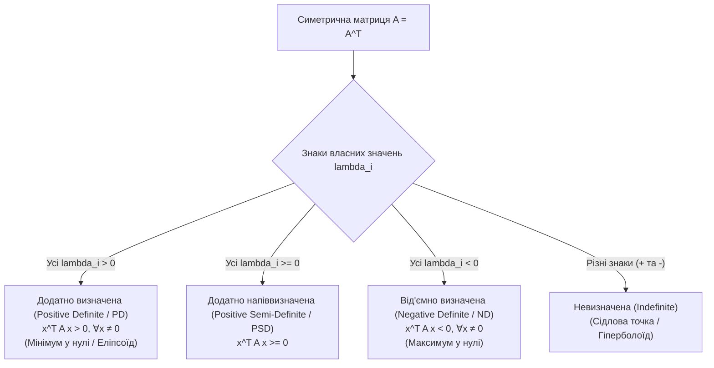

# 11. Симетричні матриці, квадратичні форми, розклад Холецького та PCA (Symmetric Matrices, Quadratic Forms, Cholesky & PCA)

[⬅️ 10. Власні значення та жорданова форма](10-eigenvalues-eigenvectors-and-jordan-form.md) | [🏠 Головний зміст](index.md) | [Наступна тема: 12. Спектральна теорія та унітарні матриці ➡️](12-symmetric-unitary-matrices-and-spectral-decomposition.md) | [⚡ Cheat Sheet](cheat-sheet.md)

---

## 🎯 Ключові концепції (Core Concepts)
1. **Спектральна теорема для дійсних симетричних матриць (Spectral Theorem for Symmetric Matrices):** Будь-яка дійсна симетрична матриця ортогонально діагоналізовна $A = Q \Lambda Q^T$.
2. **Квадратична форма (Quadratic Form $q(\mathbf{x}) = \mathbf{x}^T A \mathbf{x}$):** Геометрія еліпсоїдів та гіперболоїдів.
3. **Додатна визначеність (Positive Definiteness / PSD & PD):** Критерій Сильвестра та власні значення.
4. **Розклад Холецького (Cholesky Decomposition $A = L L^T$):** Швидкий алгоритм для симетричних додатно визначених матриць.
5. **Аналіз головних компонент (Principal Component Analysis / PCA):** Зниження розмірності через власні вектори коваріаційної матриці.

---

## 1. Спектральна теорема для симетричних матриць (Spectral Theorem)

### 1.1. Властивості дійсних симетричних матриць ($A = A^T$)
Для будь-якої дійсної симетричної матриці $A \in \mathbb{R}^{n \times n}$ виконуються **три фундаментальні теореми**:
1. **Усі власні значення є дійсними (All eigenvalues are real):** $\lambda_i \in \mathbb{R}$ (комплексних коренів немає!).
2. **Власні вектори з різних власних підпросторів ортогональні:** Якщо $\lambda_i \neq \lambda_j$, то $\mathbf{v}_i \perp \mathbf{v}_j$ ($\mathbf{v}_i^T \mathbf{v}_j = 0$).
3. **Ортогональна діагоналізовність (Orthogonal Diagonalization):** Завжди існує ортонормований базис з $n$ власних векторів в $\mathbb{R}^n$.

### 1.2. Формула спектрального розкладу
$$\mathbf{A = Q \Lambda Q^T = \sum_{i=1}^n \lambda_i \mathbf{q}_i \mathbf{q}_i^T}$$
де:
* $Q = [\mathbf{q}_1 \mid \dots \mid \mathbf{q}_n]$ — **ортогональна матриця** власних векторів ($Q^T = Q^{-1}$).
* $\Lambda = \text{diag}(\lambda_1, \dots, \lambda_n)$ — діагональна матриця дійсних власних значень.
* $\mathbf{q}_i \mathbf{q}_i^T$ — матриці ортогональної проекції рангу 1 на відповідні власні напрямки.

---

## 2. Квадратичні форми (Quadratic Forms)

### 2.1. Означення
**Квадратична форма (Quadratic Form)** від $n$ змінних $\mathbf{x} = [x_1, \dots, x_n]^T$ — це однорідний многочлен другого степеня:
$$q(\mathbf{x}) = \mathbf{x}^T A \mathbf{x} = \sum_{i=1}^n \sum_{j=1}^n a_{ij} x_i x_j$$
де $A$ — симетрична матриця ($A = A^T$).

*(Якщо початкова матриця несиметрична, її завжди можна замінити на симетричну $A_{\text{sym}} = \frac{A + A^T}{2}$, оскільки $\mathbf{x}^T A \mathbf{x} = \mathbf{x}^T A_{\text{sym}} \mathbf{x}$).*

### 2.2. Головні осі та діагоналізація форми (Principal Axes Theorem)
Зробимо заміну координат через ортогональну матрицю власних векторів: $\mathbf{x} = Q \mathbf{y}$ ($\mathbf{y} = Q^T \mathbf{x}$):
$$q(\mathbf{x}) = \mathbf{x}^T A \mathbf{x} = (Q\mathbf{y})^T A (Q\mathbf{y}) = \mathbf{y}^T (Q^T A Q) \mathbf{y} = \mathbf{y}^T \Lambda \mathbf{y} = \mathbf{\lambda_1 y_1^2 + \lambda_2 y_2^2 + \dots + \lambda_n y_n^2}$$
* Перехресні добутки ($x_i x_j$) повністю зникають!
* **Геометрія:** Поверхня рівня $\mathbf{x}^T A \mathbf{x} = 1$ є **еліпсоїдом** в $\mathbb{R}^n$, півосі якого спрямовані вздовж власних векторів $\mathbf{q}_i$, а довжини півосей дорівнюють $\frac{1}{\sqrt{\lambda_i}}$.

```text
       Головні осі еліпса (x^T A x = 1):
                 ^ y
                 |       q2 (Власний вектор / Мала піввісь = 1/sqrt(lambda2))
                 |      /
                 |   .-/--.
                 |  ( /    )
                 |   `----+----> q1 (Власний вектор / Велика піввісь = 1/sqrt(lambda1))
               --+---------\--> x
```

---

## 3. Класифікація матриць за визначеністю (Definiteness)

Симетрична матриця $A \in \mathbb{R}^{n \times n}$ називається:



### Критерії додатної визначеності ($A \succ 0$):
Наступні твердження є **еквівалентними**:
1. **За означенням:** $\mathbf{x}^T A \mathbf{x} > 0$ для всіх ненульових $\mathbf{x} \neq \mathbf{0}$.
2. **Власні значення:** Усі власні значення строго додатні: $\lambda_i > 0\quad \forall i$.
3. **Критерій Сильвестра (Sylvester's Criterion):** Усі провідні головні мінори (leading principal minors) строго додатні:
   $$\Delta_1 = a_{11} > 0, \quad \Delta_2 = \begin{vmatrix} a_{11} & a_{12} \\ a_{21} & a_{22} \end{vmatrix} > 0, \quad \dots, \quad \Delta_n = \det(A) > 0$$
4. **Матриця Грама:** $A$ можна записати як $A = B^T B$, де $B$ має повний стовпчиковий ранг.
5. **Розклад Холецького:** $A = L L^T$, де $L$ — нижня трикутна з додатними діагональними елементами.

---

## 4. Розклад Холецького (Cholesky Decomposition)

### 4.1. Суть розкладу
Для будь-якої симетричної додатно визначеної матриці ($A = A^T \succ 0$) існує **єдиний** розклад:
$$\mathbf{A = L L^T}$$
де $L$ — нижня трикутна матриця з **строго додатними елементами на головній діагоналі** ($l_{ii} > 0$):
$$
\begin{bmatrix} a_{11} & a_{12} & \dots & a_{1n} \\ a_{21} & a_{22} & \dots & a_{2n} \\ \vdots & \vdots & \ddots & \vdots \\ a_{n1} & a_{n2} & \dots & a_{nn} \end{bmatrix}
=
\begin{bmatrix} l_{11} & 0 & \dots & 0 \\ l_{21} & l_{22} & \dots & 0 \\ \vdots & \vdots & \ddots & \vdots \\ l_{n1} & l_{n2} & \dots & l_{nn} \end{bmatrix}
\begin{bmatrix} l_{11} & l_{21} & \dots & l_{n1} \\ 0 & l_{22} & \dots & l_{n2} \\ \vdots & \vdots & \ddots & \vdots \\ 0 & 0 & \dots & l_{nn} \end{bmatrix}
$$

* **Алгоритм обчислення:**
  $$l_{jj} = \sqrt{a_{jj} - \sum_{k=1}^{j-1} l_{jk}^2}, \quad l_{ij} = \frac{1}{l_{jj}} \left( a_{ij} - \sum_{k=1}^{j-1} l_{ik} l_{jk} \right) \quad (i > j)$$
* **Перевага:** Розклад Холецького потребує **у 2 рази менше операцій ($\approx \frac{1}{3} n^3$)** і вдвічі менше пам'яті, ніж звичайний LU-розклад, і є **чисельно абсолютно стійким** без необхідності перестановок рядків.

---

## 5. Метод головних компонент (Principal Component Analysis / PCA)

### 5.1. Постановка задачі Data Science & Machine Learning
Маємо центровану матрицю даних $X \in \mathbb{R}^{N \times D}$ ($N$ спостережень, $D$ ознак, середнє кожної ознаки $\boldsymbol{\mu} = \mathbf{0}$).
Потрібно спроектувати дані на підпростір меншої розмірності $k \ll D$ так, щоб **зберегти максимальну дисперсію (інформацію)**.

### 5.2. Зв'язок із коваріаційною матрицею
1. **Вибіркова матриця коваріації (Sample Covariance Matrix):**
   $$\Sigma = \frac{1}{N-1} X^T X \in \mathbb{R}^{D \times D}$$
   *(Матриця $\Sigma$ є симетричною та додатно напіввизначеною: $\Sigma = \Sigma^T \succeq 0$).*
2. **Спектральний розклад коваріації:**
   $$\Sigma = Q \Lambda Q^T = \sum_{j=1}^D \lambda_j \mathbf{q}_j \mathbf{q}_j^T, \quad \lambda_1 \ge \lambda_2 \ge \dots \ge \lambda_D \ge 0$$
   * **Власні вектори $\mathbf{q}_j$ (Напрямки головних компонент / Principal Directions / Loadings):** Вектор $\mathbf{q}_1$ задає напрямок найбільшої варіації даних, $\mathbf{q}_2$ — другий ортогональний напрямок тощо.
   * **Власні значення $\lambda_j$ (Дисперсії):** $\text{Var}(\mathbf{z}_j) = \lambda_j$ дорівнює дисперсії даних вздовж $j$-ї головної компоненти!
3. **Зниження розмірності:**
   Матриця проекції на перші $k$ компонент $W_k = [\mathbf{q}_1 \mid \dots \mid \mathbf{q}_k] \in \mathbb{R}^{D \times k}$:
   $$Z = X W_k \in \mathbb{R}^{N \times k}$$
4. **Частка збереженої дисперсії (Explained Variance Ratio):**
   $$\text{EVR}_k = \frac{\sum_{i=1}^k \lambda_i}{\sum_{i=1}^D \lambda_i} = \frac{\sum_{i=1}^k \lambda_i}{\text{tr}(\Sigma)}$$

---

## 📊 Зведена таблиця (Summary Table)

| Поняття | Формула | Властивість |
|---|---|---|
| Спектральна теорема | $A = Q \Lambda Q^T$ | $Q^T Q = I, \quad \lambda_i \in \mathbb{R}$ |
| Квадратична форма | $q(\mathbf{x}) = \mathbf{x}^T A \mathbf{x}$ | $q(\mathbf{y}) = \sum \lambda_i y_i^2$ у базисі власних векторів |
| Додатна визначеність | $A \succ 0 \iff \forall \lambda_i > 0$ | Критерій Сильвестра $\Delta_k > 0$ |
| Розклад Холецького | $A = L L^T$ | $L$ — lower triangular, $l_{ii} > 0$ |
| PCA | $\Sigma = \frac{1}{N-1} X^T X = Q\Lambda Q^T$ | $\mathbf{q}_i$ — головні компоненти, $\lambda_i$ — дисперсія |

---

[⬅️ 10. Власні значення та жорданова форма](10-eigenvalues-eigenvectors-and-jordan-form.md) | [🏠 Головний зміст](index.md) | [Наступна тема: 12. Спектральна теорія та унітарні матриці ➡️](12-symmetric-unitary-matrices-and-spectral-decomposition.md) | [⚡ Cheat Sheet](cheat-sheet.md)

